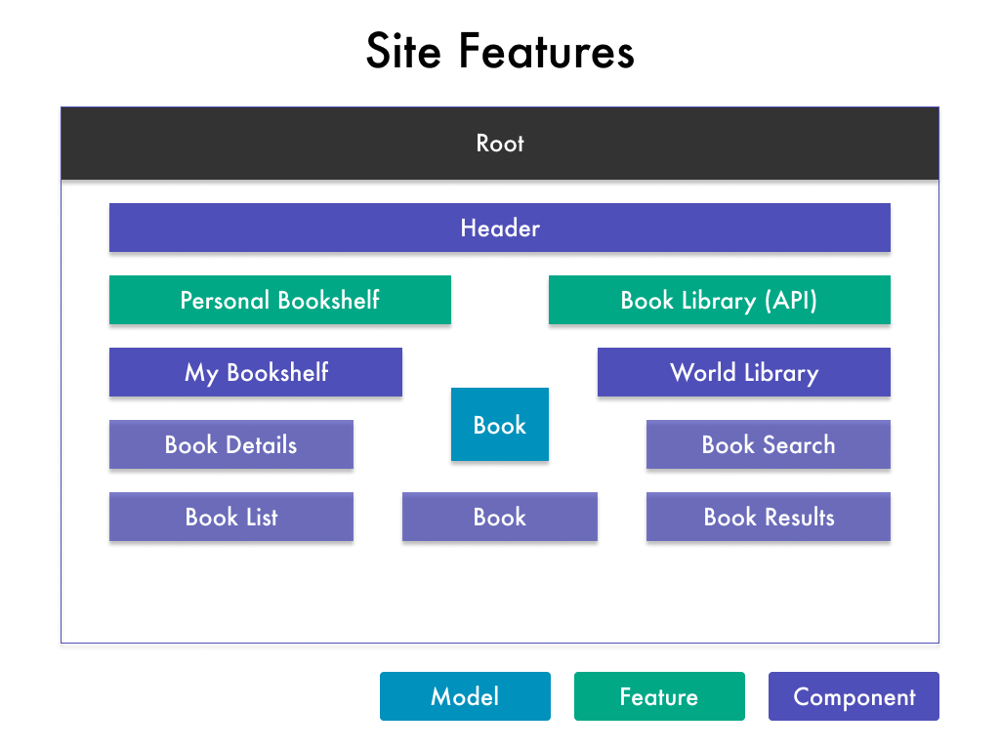
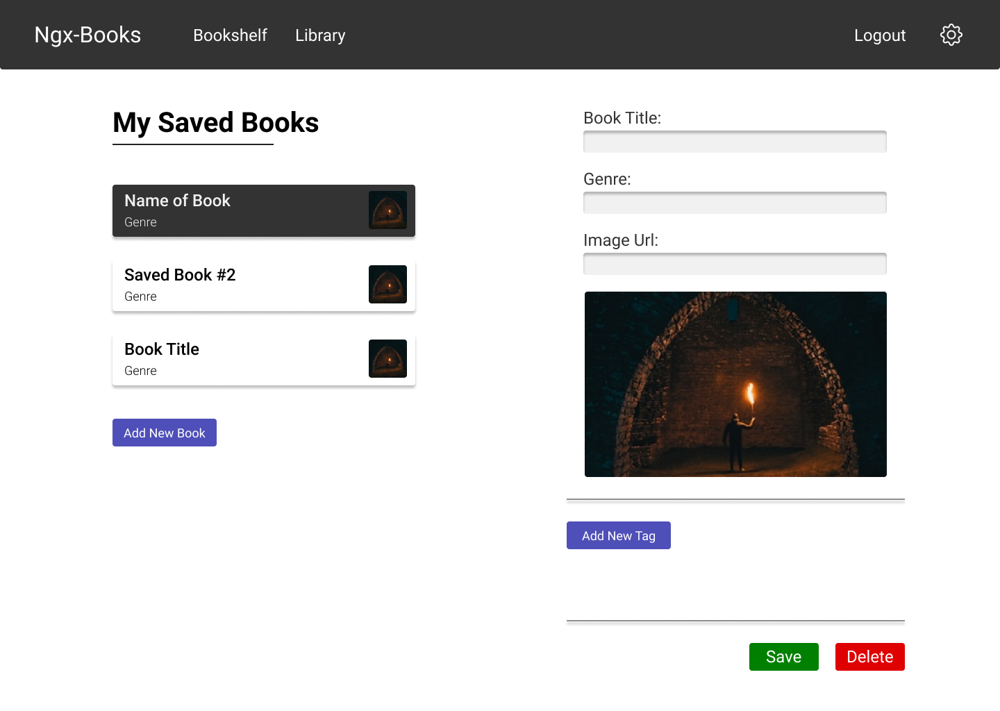

# Class 4 - Course Basics && Debugging

---

## Steps

### Planning the Application

**What are the features?**



**What is the Design/UI flow?**





---

### Starting a New Project

```zsh
    ng new BookIt --no-strict

    npm install --save bootstrap@4
```

1. Import "node_modules/bootstrap/dist/css/bootstrap.min.css" in angular.json under "styles" tag.
2. Clear App component HTML.
3. Test For Bootstrap by adding a container div with a row and column with text inside.

```zsh
    ng serve
```

---

### Add Starting Components & File Structure

```zsh
    ng g c navigation --skip-tests=true

    ng g c bookshelf --skip-tests=true

    ng g c library --skip-tests=true
```

- Walk through the components.
- Make sure they are all uploaded in app.module.ts

```zsh
    ng g c bookshelf/book-list --skip-tests=true

    ng g c bookshelf/book-details --skip-tests=true

    ng g c shared/book --skip-test=true

    ng g c library/book-search --skip-tests=true

    ng g c library/book-results --skip-tests=true
```

- Add shared folder
- Add `<app-navigation></app-navigation>` to App Component HTML.

RESULT:

```html
<div class="container">
  <app-navigation></app-navigation>
</div>
```

---

### Displaying Your Components

**Inside App Component HTML**

- Add `<app-bookshelf></app-bookshelf>` && `<app-library></app-library>`

RESULT:

```html
<div class="container">
  <app-navigation></app-navigation>
  <div class="row app-row">
    <div class="col-md-10 mx-auto">
      <app-bookshelf></app-bookshelf>
      <hr />
      <app-library></app-library>
    </div>
  </div>
</div>
```

**Inside Bookshelf Component HTML**

- Add `<app-book-list></app-book-list>` && `<app-book-details></app-book-details>`

RESULT:

```html
<div class="row justify-content-between">
  <div class="col-md-6">
    <h1>My Saved Books</h1>
    <app-book-list></app-book-list>
  </div>
  <div class="col-md-5">
    <app-book-details></app-book-details>
  </div>
</div>
```

**Inside Library Component HTML**

- Add `<app-book-search></app-book-search>` && `<app-book-results></app-book-results>`

RESULT:

```html
<div class="row">
  <div class="col-md-6">
    <h1>API Library Results</h1>
  </div>
  <div class="col-md-6">
    <app-book-search></app-book-search>
  </div>
</div>
<div class="row">
  <div class="col-md-12">
    <app-book-results></app-book-results>
  </div>
</div>
```

**Inside Bookshelf/Book-List Component HTML**

- Add 3 `<app-book></app-book>` Components.

RESULT:

```html
<div class="row mb-3">
  <div class="col-md-12">
    <app-book></app-book>
    <app-book></app-book>
    <app-book></app-book>
  </div>
</div>
```

**Inside Library/Book-Results Component HTML**

- Add 3 `<app-book></app-book>` Components.

RESULT:

```html
<div class="row mb-3">
  <div class="col-md-12">
    <app-book></app-book>
    <app-book></app-book>
    <app-book></app-book>
  </div>
</div>
```

---

### Adding Navigation to the App

**Inside Shared/Navigation Component HTML**

- Add Navbar, Collapse Menu, Links, and Dropdown Toggler.
- \*If you don't want to type all this... go to: https://getbootstrap.com/docs/4.0/components/navbar/#nav ... find the one with a dropdown ... add the required tweaks. (This is what we would do in the "real world" anyway!)
- Make sure to add declarations in the typescript file for `collapsed: boolean = true; show: boolean = false;`

RESULT:

```html
<nav class="navbar navbar-dark bg-dark navbar-expand-lg mb-4">
  <a class="navbar-brand brand" id="brand" href="#">BookIt</a>
  <button
    class="navbar-toggler"
    type="button"
    data-toggle="collapse"
    data-target="#navbarToggler"
    aria-label="Toggle navigation"
    aria-controls="navbarToggler"
    aria-expanded="false"
    (click)="collapsed = !collapsed"
  >
    <span class="navbar-toggler-icon"></span>
  </button>

  <div
    class="collapse navbar-collapse"
    id="navbarToggler"
    [class.collapse]="collapsed"
    (window:resize)="collapsed = true"
  >
    <ul class="navbar-nav mr-auto mt-2 mt-lg-0">
      <li class="nav-item">
        <a class="nav-link" href="#">Bookshelf</a>
      </li>
      <li class="nav-item">
        <a class="nav-link" href="#">Library</a>
      </li>
    </ul>
    <ul class="navbar-nav">
      <li class="nav-item dropdown">
        <a
          class="nav-link dropdown-toggle"
          href="#"
          id="navbarDropdownMenuLink"
          data-toggle="dropdown"
          aria-haspopup="true"
          [attr.aria-expanded]="show"
          (click)="show = !show"
          [class.show]="show"
        >
          Settings
        </a>
        <div
          class="dropdown-menu"
          aria-labelledby="navbarDropdownMenuLink"
          [class.show]="show"
        >
          <a class="dropdown-item" href="#">Save Data</a>
          <a class="dropdown-item" href="#">Fetch Data</a>
        </div>
      </li>
    </ul>
  </div>
</nav>
```

---

### Adding the Book Model and Instantiations

**Inside Shared/Book Folder**

- Create book.model.ts file.

RESULT:

```js
export class Book {
  public title: string;
  public author: string;
  public genre: string;
  public coverImagePath: string;

  constructor(title: string, author: string, genre: string, img: string) {
    this.title = title;
    this.author = author;
    this.genre = genre;
    this.coverImagePath = img;
  }
}
```

**Inside Bookshelf/Book-List Typescript File**

- Add myBooks array with dummy data

RESULT:

```js
  myBooks: Book[] = [
    new Book(
      'Book of Testing',
      'Will Wilder',
      'Mystery',
      'https://source.unsplash.com/50x50/?mystery,book'
    )
  ];
```

**Inside Bookshelf/Book-List HTML File**

- Add ngFor loop to display all books.
- Add "Add New Book" Button.
- Test functionality by copy and pasting two more books into the array.
- Add text interpolation for: Title, Genre, and Image

RESULT:

```html
<div class="row mb-3" *ngFor="let book of myBooks">
  <div class="col-md-12">
    <a href="#" class="list-group-item clearfix">
      <div class="float-left">
        <h4 class="list-group-item-heading">{{ book.title }}</h4>
        <p class="list-group-item-text mb-0">{{ book.genre }}</p>
      </div>
      <div class="float-right">
        
      </div>
    </a>
  </div>
</div>

<hr />

<div class="row">
  <div class="col-md-12">
    <button class="btn btn-primary">Add New Book</button>
  </div>
</div>
```

---

### Creating the Book Details

**Inside Bookshelf/Book-Details HTML File**

- Add rows for the title, author, genre, image, tags, and edit book button. (use copy paste).

RESULT:

```html
<div class="row">
  <div class="col-md-12">
    <h2>Book Title</h2>
  </div>
</div>

<div class="row">
  <div class="col-md-12">
    <h3>Author</h3>
  </div>
</div>

<div class="row">
  <div class="col-md-12">
    <p>Genre</p>
  </div>
</div>

<div class="row">
  <div class="col-md-12">
    
  </div>
</div>

<div class="row">
  <div class="col-md-12">
    <small>Tags</small>
  </div>
</div>

<hr />

<div class="row">
  <div class="col-md-12">
    <button type="button" class="btn btn-primary">Edit Book</button>
  </div>
</div>
```

---

### Working on the Libary Page

**Inside Library/Book-Results HTML File**

- Copy book-list html and paste it here.
  _Be sure to mention DRY Coding and why we shouldn't have two components doing basically the same thing... and that we will eventually put this logic in the book component!!_
- Delete the "Add New Book" Button.
- Change the ngFor loop to "let book of allBooks"
- Add the allBooks array in the typescript file... the same as in the book-list component.

RESULT:

```html
<div class="row mb-3" *ngFor="let book of allBooks">
  <div class="col-md-12">
    <a href="#" class="list-group-item clearfix">
      <div class="float-left">
        <h4 class="list-group-item-heading">{{ book.title }}</h4>
        <p class="list-group-item-text mb-0">{{ book.genre }}</p>
      </div>
      <div class="float-right">
        
      </div>
    </a>
  </div>
</div>
```

---

---

### Debugging an Angular App

1. Show them Chrome Developer Tools Console... test out some console.log() statements in your code.
2. Tell them to read the error messages carefully and google them if you don't understand.
3. Let them know the different ways to fix code when they get stuck
   - Read through line by line to "Follow the Logic"
   - Google Error Messages
   - Use Debugger Tool
   - Ask Fellow Developer
   - Post on StackOverflow
4. Show them how to debug using the browser sourcemaps debugger tool by navigating to the SOURCE panel, click on WEBPACK then . then SRC ...

---

---

#### Extra Time

1. Add Roboto Font.
   - Go to google fonts and find roboto.
   - Add the ones you want: Light, Regular, Medium, Bold
   - Copy the Link
   - Paste in the index.html file
   - Add to root styles.css file

RESULT:

```css
html,
body,
input,
label,
button,
a {
  font-family: 'Roboto', sans-serif;
  font-weight: 400;
}
h1 {
  font-size: 2rem;
  font-weight: 700;
}

h2 {
  font-weight: 500;
}

p,
small,
span {
  font-weight: 300;
}
```

---

2. Refactor the book.module.ts file to make it all happen in the constructor argument field.

MODEL:

```js
export class Book {
  constructor(public title: string, public author: string, public genre: string, public coverImagePath: string) {}
}
```

---

3. Add Styles:
   - In Angular.Json file, add the .scss extension to our root styles import.
   - In styles.scss Add Our themes and import bootstrap.
   - In App.css add media query and padding.
   - In Navigation.css add link styling.

STYLES.SCSS:

```scss
    $primary:#4F4FB9;
    $black: #222;
    $white: #f1f1f1;
    @import "bootstrap";
    . . .
```

APP.CSS:

```css
.container {
  padding: 0;
  overflow: hidden;
}

@media (max-width: 700px) {
  .app-row {
    padding: 0.75em 1.25em;
  }
}
```

NAVIGATION.CSS:

```css
nav {
  padding: 1.75em;
  border-bottom-left-radius: 4px;
  border-bottom-right-radius: 4px;
}

#brand {
  font-weight: 500;
  font-size: 1.5rem;
  margin: 0 1.25em 0 0;
}

nav a {
  font-size: 1.25rem;
  margin-right: 0.75em;
}
```

---

4. Split the Library/Book-Results into two columns / arrays

HTML:

```html
<div class="mb-3 row">
  <div class="col-md-6" *ngFor="let book of bookCol1">
    <a href="#" class="list-group-item clearfix">
      <div class="float-left">
        <h4 class="list-group-item-heading">{{ book.title }}</h4>
        <p class="list-group-item-text mb-0">{{ book.genre }}</p>
      </div>
      <div class="float-right">
        
      </div>
    </a>
    <!-- <app-book></app-book> -->
  </div>

  <div class="col-md-6" *ngFor="let book of bookCol2">
    <a href="#" class="list-group-item clearfix">
      <div class="float-left">
        <h4 class="list-group-item-heading">{{ book.title }}</h4>
        <p class="list-group-item-text mb-0">{{ book.genre }}</p>
      </div>
      <div class="float-right">
        
      </div>
    </a>
    <!-- <app-book></app-book> -->
  </div>
</div>
```

TYPESCRIPT:

```js
export class BookResultsComponent implements OnInit {
  allBooks: Book[] = [
    new Book(
      'Testing API Books 2',
      'Bill',
      'Science',
      'https://source.unsplash.com/50x50/?science,book'
    ),
    new Book(
      'Library Test',
      'Rando',
      'Non-Fiction',
      'https://source.unsplash.com/50x50/?fantasy,book'
    ),
    new Book(
      'Book of API',
      'Will Wilder',
      'Mystery',
      'https://source.unsplash.com/50x50/?mystery,book'
    ),
  ]
  bookCol1: Book[] = []
  bookCol2: Book[] = []

  constructor() {}

  ngOnInit(): void {
    this.allBooks.forEach((book, idx) => {
      if (idx % 2 === 0) {
        this.bookCol1.push(book)
      } else {
        this.bookCol2.push(book)
      }
    })
  }
}
```
